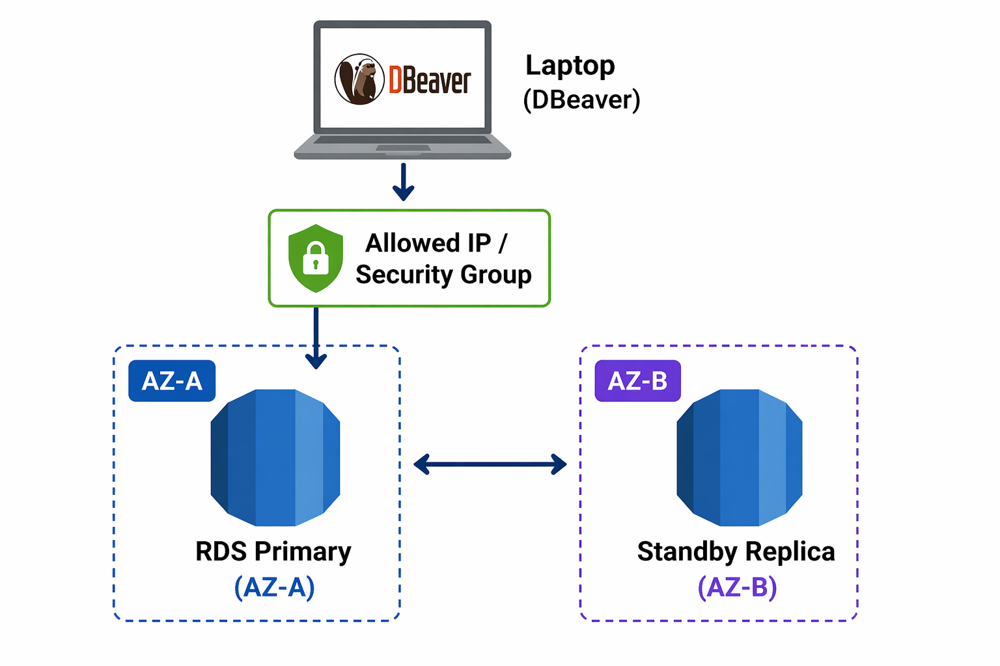
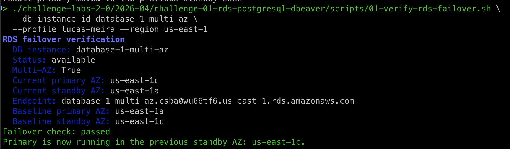

# Challenge 01: RDS + PostgreSQL + DBeaver

## Challenge objective
Create a relational database on Amazon RDS using PostgreSQL, connect to it remotely through DBeaver, and create a sample table while reviewing the main operational concepts around access, backups, allocation models, and high availability.

### Mandatory constraints
- The database engine for this challenge must be PostgreSQL.
- The connection must be tested remotely through DBeaver.
- A relational table must be created as part of the validation.
- Security Group exposure must be reviewed before enabling remote access.
- Backup, snapshot, cleanup, and Multi-AZ concepts must be covered in the challenge.

## Scope
- RDS fundamentals
- PostgreSQL instance creation on Amazon RDS
- Security Group and remote access review
- DBeaver connection validation
- Basic SQL execution and table creation
- On-Demand and Reserved allocation concepts
- Backups, snapshots, and restore concepts
- Multi-AZ practical understanding
- Resource cleanup

## Challenge brief
This challenge is the entry point for the relational database track starting in `2026-04`.

The goal is to understand Amazon RDS from a practical perspective without turning the document into a step-by-step tutorial. The expected outcome is a PostgreSQL instance running on RDS, a successful remote connection through DBeaver, and a simple relational table created as proof of access and SQL execution.

The challenge also introduces the main operational decisions around RDS:
- when a temporary lab should remain On-Demand
- why remote database exposure must stay tightly controlled
- how backups and snapshots serve different recovery purposes
- why Multi-AZ is about availability rather than logical restore

## Prerequisites
- AWS account with permission to work with Amazon RDS, VPC, and Security Groups
- A region selected for the lab
- DBeaver installed locally
- Outbound connectivity from your machine to PostgreSQL on port `5432`
- Basic understanding of database, table, row, and primary key concepts

## Expected deliverables
- One PostgreSQL DB instance created on Amazon RDS
- One successful remote connection from DBeaver
- One sample table created in the database
- A short understanding of:
  - On-Demand vs Reserved allocation
  - backups vs snapshots
  - single-AZ vs Multi-AZ
- All lab resources reviewed for cleanup at the end

---

## Phase 1: RDS fundamentals and challenge framing

### Focus
Understand what Amazon RDS manages for you and what remains your responsibility during the challenge.

### Key topics
- Managed relational database service
- PostgreSQL as the selected engine
- DB instance, endpoint, credentials, and connectivity
- Difference between availability, durability, and accessibility

### Validation
- Be able to explain what RDS abstracts compared to self-managed database hosting.
- Identify the core console areas related to databases, snapshots, and connectivity.

---

## Phase 2: Create a PostgreSQL RDS instance

### Focus
Provision a PostgreSQL DB instance suitable for lab use, while checking the settings that most directly affect cost.

### What must be defined
- engine: `PostgreSQL`
- instance identifier
- master username and password
- storage and instance class appropriate for a lab
- connectivity model for remote access
- deletion protection strategy for the lab

### Instance class guidance
- `Standard classes`, including the `M` families:
  - balanced compute, memory, and networking
  - good default for general-purpose database workloads
- `Memory-optimized classes`, including the `R` and `X` families:
  - higher memory-to-vCPU ratio
  - better suited to memory-heavy workloads, larger caches, and databases that benefit from more RAM
  - usually more expensive than a balanced general-purpose class
- `Burstable classes`, including the `T` families:
  - low-cost entry point for light or variable workloads
  - suitable for labs and small development environments
  - require attention because sustained CPU usage can trigger extra CPU credit charges in Unlimited mode

### Cost-sensitive settings to define and verify
- `Free Tier eligibility`:
  - Verify against the current official pricing page instead of assuming the console default is free-tier safe.
  - As of `April 20, 2026`, AWS states that new AWS customers can use the RDS for PostgreSQL free tier for `12 months`, including `750 hours` on a selection of `Single-AZ` instance databases, `20 GB` of General Purpose SSD (`gp2`) storage, and `20 GB` of automated backup storage each month.
  - For this challenge, confirm all three dimensions: deployment type, instance class, and storage allocation.
- `Instance class / processor tier`:
  - The DB instance class defines compute and memory capacity, so it is one of the main cost drivers.
  - For a lab, prefer the smallest supported class that still allows PostgreSQL and remote testing comfortably.
  - If you choose a burstable `T3` or `T4g` class, verify CPU behavior carefully. AWS pricing states these run in Unlimited mode and can generate extra CPU credit charges if average CPU utilization exceeds the baseline over a rolling 24-hour period.
- `Storage / hard disk`:
  - Storage is billed per provisioned GB-month.
  - For new RDS storage, AWS documentation recommends `gp3` as the default general-purpose SSD option.
  - Provisioned IOPS storage adds separate performance-related charges, so it should not be the default choice for this lab.
  - Keep storage at the minimum practical size for PostgreSQL and the sample table exercise.
  - Storage autoscaling grows allocated storage capacity, not logical table data.
  - If storage autoscaling is enabled, the `maximum storage threshold` is the upper limit that autoscaling can grow to. AWS documentation says it must be at least `10%` higher than current allocated storage, and recommends at least `26%` more to avoid threshold-approaching events.
  - RDS storage autoscaling only grows upward. It does not automatically shrink allocated storage after data is deleted.
  - Billing follows the allocated storage after growth, so the maximum storage threshold is also a cost-control setting.
  - To reduce allocated storage later, plan a replacement workflow: restore from snapshot or migrate/export data into a new DB instance with the desired smaller storage size, validate the new instance, switch clients, and delete the old larger instance after backup and access checks.

> Warning: For a small DBeaver/table lab, storage autoscaling is usually unnecessary. If enabled, the maximum storage threshold must be intentional because allocated storage can grow and continue to affect cost.

- `Monitoring`:
  - Basic CloudWatch visibility is part of the normal RDS experience, but optional monitoring features can add cost.
  - Enhanced Monitoring is disabled by default and sends OS metrics to CloudWatch Logs; AWS guidance states pricing depends on transferred monitoring data and log storage.
  - Performance Insights is in transition: AWS documentation says the Performance Insights console experience and its paid retention model reach end-of-life on `June 30, 2026`. For this challenge, avoid enabling paid monitoring features unless you are explicitly testing them.
- `Network and access model`:
  - Public access is mainly a security decision, but network transfer is still a pricing dimension on the RDS pricing page.
  - Based on AWS pricing categories, the network-related RDS cost to watch is `data transfer`, not the Security Group itself.
  - For a short lab, keep the design simple: one DB instance, one narrow inbound rule, and no unnecessary high-availability or replication features during creation.
  - For this challenge, use the default VPC unless you have a specific network requirement to test.
  - Direct DBeaver access from a local machine requires `Public access = true` and a dedicated or personalized Security Group, unless you use a private access path such as VPN, Direct Connect, bastion, SSH tunnel, or SSM port forwarding.
  - RDS public IPv4 addressing is managed by RDS. Do not manually attach a public IPv4 address to an RDS DB instance like you would with an EC2 instance.
  - `Public access = true` only makes public routing possible. Security Group inbound rules still decide whether the client can connect.
  - IPv6 access requires a compatible dual-stack setup: VPC, subnets, DB subnet group, client network, and Security Group rule must all support IPv6.
  - Keep the database port explicit as `5432` for PostgreSQL.
- `Database authentication`:
  - Current RDS authentication categories include `password authentication`, `IAM database authentication`, and `Kerberos authentication`.
  - For PostgreSQL, a specific user should use only one authentication method.
  - For this lab, `password authentication` is the simplest baseline unless the challenge is explicitly extended to IAM or Active Directory integration.
- `Deployment option`:
  - Keep the instance `Single-AZ` for the initial lab unless the goal is explicitly to test high availability.
  - Multi-AZ changes both architecture and cost because it adds standby capacity.
- `Deletion protection`:
  - Deletion protection blocks the DB instance from being deleted until the setting is turned off.
  - AWS documentation states that DB instances created through the console have deletion protection enabled by default.
  - For this challenge, decide explicitly whether you want creation-time protection against accidental deletion or easier cleanup at the end of the lab.

### Recommended lab baseline
- engine: `PostgreSQL`
- deployment: `Single-AZ`
- instance class: smallest supported lab-sized class, usually from a burstable family for a cost-controlled lab
- storage: minimum practical General Purpose SSD
- storage performance add-ons: disabled unless specifically required
- maximum storage threshold: set intentionally only if storage autoscaling is enabled
- Enhanced Monitoring: off
- paid monitoring add-ons: off
- VPC connectivity: default
- public access: enabled only if required for DBeaver, then restricted by a personalized Security Group in Phase 3
- port: `5432`
- authentication: password authentication
- deletion protection: on only if you want explicit protection during the lab and remember to disable it before cleanup

### What to verify before clicking Create
- The estimated monthly cost in the console does not contradict your lab intention.
- The instance is still `Single-AZ`.
- The selected class is not oversized for a simple connection-and-table lab.
- Storage is minimal and not using provisioned IOPS unnecessarily.
- The maximum storage threshold is understood if storage autoscaling is enabled.
- Storage autoscaling is understood as upward-only allocated capacity growth, not automatic shrink-back.
- The shrink-back path is understood at a high level: snapshot or export, create a smaller replacement, validate, switch clients, and delete the old instance.
- Optional monitoring features are not enabled by accident.
- The chosen authentication mode matches the challenge scope.
- The engine major version is current enough that you are not introducing avoidable extended-support cost later.
- Deletion protection is set intentionally rather than left as an unnoticed default.

### Validation
- The DB instance reaches `Available` status.
- The endpoint, port, database name, and username are recorded for connection testing.

---

## Phase 3: Review permissions and remote access

### Focus
Allow DBeaver access without exposing the database broadly.

### Key topics
- Security Group attached to the DB instance
- inbound PostgreSQL access on port `5432`
- source restriction to a single public IP whenever direct remote access is required
- recommended IPv4 rule: `TCP 5432` from `<client-public-ip>/32`
- optional IPv6 rule: `TCP 5432` from `<client-ipv6>/128`
- avoid `0.0.0.0/0` and `::/0` as normal lab rules because they expose the database port broadly
- private alternatives when `Public access = false`: VPN, Direct Connect, bastion, SSH tunnel, or SSM port forwarding

> Warning: Public access plus a broad Security Group exposes PostgreSQL to the internet. The safe lab baseline is public access with a single client IP rule.

### Validation
- The database is reachable from the workstation used for the lab.
- The Security Group is not left open to unrestricted public access.
- The DB instance remains protected by Security Group rules even when `Public access = true`.
- Any temporary broad source rule is removed immediately after testing.

---

## Phase 4: Connect with DBeaver and create a table

### Focus
Validate the database connection and confirm basic relational operations.

### Expected connection inputs
- RDS endpoint
- port `5432`
- database name
- username
- password

### Example SQL
```sql
CREATE TABLE course_notes (
    id SERIAL PRIMARY KEY,
    topic VARCHAR(100) NOT NULL,
    learned_at TIMESTAMP NOT NULL DEFAULT CURRENT_TIMESTAMP,
    notes TEXT
);

INSERT INTO course_notes (topic, notes)
VALUES
    ('Amazon RDS', 'Created a PostgreSQL instance and connected remotely through DBeaver'),
    ('Security Groups', 'Restricted PostgreSQL access to a single public IP');

SELECT id, topic, learned_at, notes
FROM course_notes
ORDER BY id;
```

### Validation
- DBeaver connects successfully to the RDS instance.
- The table is created.
- Sample rows are inserted and returned by a query.

---

## Phase 5: Allocation model review

### Focus
Understand the difference between `On-Demand` and `Reserved` usage in the context of RDS.

### Core differences and trade-offs
- `On-Demand`:
  - no long-term commitment
  - billed for instance usage as the DB instance runs
  - better for short-term labs, temporary environments, and uncertain demand
  - easier to change instance class, stop using the resource, or delete it without commitment risk
- `Reserved`:
  - discount model tied to a `1-year` or `3-year` commitment
  - best for stable, predictable workloads that will run for a long period
  - offers payment models such as `No Upfront`, `Partial Upfront`, and `All Upfront`
  - lowers compute cost, but does not remove separate charges for storage, backups, snapshots, or data transfer

### Reserved-specific points to understand
- A Reserved DB instance is a billing discount, not a different technical DB deployment model.
- The reservation is tied to the `DB instance type` and Region.
- For `RDS for PostgreSQL`, size flexibility applies within the same instance class family.
- In practice, that means a reservation can still help after resizing only when the new class stays in the same family, such as moving within `db.r6i` sizes.
- If you move to a different family, the Reserved discount no longer applies to that usage.
- AWS uses `normalized units per hour` to apply size-flexible Reserved capacity across sizes in the same family.
- Reserved benefits can apply across both `Single-AZ` and `Multi-AZ` usage, but the normalized-unit coverage changes with the deployment shape.

### Decision guidance for this challenge
- Use `On-Demand` for this lab because the environment is temporary and the priority is learning, not long-term cost optimization.
- Treat `Reserved` as a production-oriented cost strategy for workloads with stable runtime, known sizing, and long-term commitment confidence.

> Warning: Reserved DB instances are a long-term billing commitment for predictable workloads. They do not replace architecture decisions and they do not remove storage, backup, snapshot, or data transfer costs.

### Validation
- Be able to explain why this challenge should be treated as an On-Demand scenario.
- Be able to explain that Reserved discounts are about billing commitments, not about a different RDS engine or deployment type.
- Be able to explain why resizing inside the same family matters for size-flexible Reserved coverage.

---

## Phase 6: Backups, snapshots, and restore concepts

### Focus
Review the recovery options available for an RDS database.

### Key topics
- automated backups
- retention period
- manual DB snapshots
- restore from snapshot
- point-in-time restore
- difference between recovery features and deletion protection
- restore as part of a storage right-sizing workflow because restore creates a new DB instance

> Warning: Backups and snapshots improve recovery, but they also preserve sensitive data. Retention, encryption, access control, and cleanup must be reviewed with the same care as the live database.

### Validation
- Be able to distinguish automated backups from manual snapshots.
- Identify which option supports ongoing recovery windows and which one remains until explicitly deleted.
- Be able to explain that deletion protection is a safeguard against accidental deletion, not a backup or restore mechanism.
- Be able to explain how restore can support storage right-sizing when a smaller replacement instance is needed.

---

## Phase 7: Multi-AZ practical understanding

### Focus
Understand what Multi-AZ changes in terms of resilience and availability.

### Key topics
- what `Multi-AZ` is:
  - a deployment model that maintains a primary DB instance and a standby in another Availability Zone for failover support
- what `Multi-AZ` is for:
  - high availability
  - infrastructure resilience
  - reducing downtime during planned or unplanned failover events
- what `Multi-AZ` is not for:
  - it is not a replacement for backups or snapshots
  - in a Multi-AZ DB instance deployment, the standby doesn't serve normal read traffic
- Availability Zone and secondary zone concepts:
  - one zone hosts the current primary instance
  - another zone hosts the standby instance
  - in a Multi-AZ DB instance deployment, one instance is always in standby
- creation guidance:
  - to launch a Multi-AZ DB instance deployment, enable the Multi-AZ option during DB creation or modify the DB instance later to add the standby
  - for a low-cost lab trial, the `Dev/Test` template is the more realistic baseline than a strict free-tier-aligned setup because Multi-AZ requires standby capacity
- failover demonstration:
  - the practical failover test for a Multi-AZ DB instance deployment is `reboot with failover`
  - during failover, the primary can move from one Availability Zone to the former standby zone and the standby becomes the new primary
  - AWS documentation says failover for a Multi-AZ DB instance typically completes in `60-120 seconds`, though large transactions or recovery work can extend it

Architecture supporting Multi-AZ failover and controlled remote access.


### Practical demonstration notes
- Example scenario:
  - current primary in zone `c`
  - standby in zone `b`
  - after `reboot with failover`, the former standby in zone `b` becomes the new primary
- The DB endpoint remains the same, but the underlying IP address can change after failover.
- A simple way to watch the DNS target shift is:

```bash
while true; do host <rds-endpoint> | grep alias; sleep 1; done
```

- Replace `<rds-endpoint>` with the actual RDS endpoint hostname.
- Run the loop from a local shell or a bastion host that has DNS visibility to the endpoint.
- To verify the RDS primary and standby zones through AWS metadata, use:

```bash
# Before reboot with failover
./challenge-labs-2-0/2026-04/challenge-01-rds-postgresql-dbeaver/scripts/01-verify-rds-failover.sh \
  --db-instance-id <db-instance-id> \
  --save-baseline

# After reboot with failover
./challenge-labs-2-0/2026-04/challenge-01-rds-postgresql-dbeaver/scripts/01-verify-rds-failover.sh \
  --db-instance-id <db-instance-id>
```
Evidence that failover recovery succeeded after reboot with failover.


### Validation
- Be able to explain that Multi-AZ improves availability, but does not replace backups or snapshots.
- Be able to explain that one instance stays in standby in a Multi-AZ DB instance deployment.
- Be able to explain why a free-tier-aligned single-instance setup is different from a Multi-AZ trial.
- Be able to describe a `reboot with failover` test and what changes during the transition.

---

## Phase 8: Cleanup

### Focus
Remove the lab resources intentionally and avoid unnecessary cost.

### Items to review before deletion
- whether deletion protection is enabled and must be turned off first
- whether a final snapshot should be kept
- whether manual snapshots should remain
- whether Security Group rules added for the lab should be removed

### Validation
- The DB instance is deleted when the lab is complete.
- Temporary access rules and retained snapshots are accounted for.
- The lab does not get stuck at deletion time because deletion protection was forgotten.

---

## References
- Amazon RDS documentation: https://docs.aws.amazon.com/AmazonRDS/latest/UserGuide/
- Infrastructure security in Amazon RDS: https://docs.aws.amazon.com/AmazonRDS/latest/UserGuide/infrastructure-security.html
- Working with a DB instance in a VPC: https://docs.aws.amazon.com/AmazonRDS/latest/UserGuide/USER_VPC.WorkingWithRDSInstanceinaVPC.html
- Controlling access with security groups: https://docs.aws.amazon.com/AmazonRDS/latest/UserGuide/Overview.RDSSecurityGroups.html
- Amazon RDS for PostgreSQL pricing: https://aws.amazon.com/rds/postgresql/pricing/
- Reserved DB instances for Amazon RDS: https://docs.aws.amazon.com/AmazonRDS/latest/UserGuide/USER_WorkingWithReservedDBInstances.html
- On-Demand vs Reserved Instances comparison: https://aws.amazon.com/compare/the-difference-between-on-demand-instances-and-reserved-instances/#summary-of-differences-on-demand-compared-with-reserved-instance--ju5zvk
- Amazon RDS getting started: https://docs.aws.amazon.com/AmazonRDS/latest/UserGuide/CHAP_GettingStarted.html
- Working with DB instances in Amazon RDS: https://docs.aws.amazon.com/AmazonRDS/latest/UserGuide/USER_CreateDBInstance.html
- DB instance classes: https://docs.aws.amazon.com/AmazonRDS/latest/UserGuide/Concepts.DBInstanceClass.html
- DB instance class types: https://docs.aws.amazon.com/AmazonRDS/latest/UserGuide/Concepts.DBInstanceClass.Types.html
- Amazon RDS DB instance storage: https://docs.aws.amazon.com/AmazonRDS/latest/UserGuide/CHAP_Storage.html
- Working with backups in Amazon RDS: https://docs.aws.amazon.com/AmazonRDS/latest/UserGuide/USER_WorkingWithAutomatedBackups.html
- Monitoring DB load with Performance Insights on Amazon RDS: https://docs.aws.amazon.com/AmazonRDS/latest/UserGuide/USER_PerfInsights.html
- Choosing the new monitoring view from the Monitoring tab: https://docs.aws.amazon.com/AmazonRDS/latest/UserGuide/Viewing_Unifiedmetrics.MonitoringTab.html
- Amazon RDS Multi-AZ deployments: https://docs.aws.amazon.com/AmazonRDS/latest/UserGuide/Concepts.MultiAZ.html
- Failing over a Multi-AZ DB instance for Amazon RDS: https://docs.aws.amazon.com/AmazonRDS/latest/UserGuide/Concepts.MultiAZ.Failover.html
- Managing capacity automatically with Amazon RDS storage autoscaling: https://docs.aws.amazon.com/AmazonRDS/latest/UserGuide/USER_PIOPS.Autoscaling.html
- Database authentication with Amazon RDS: https://docs.aws.amazon.com/AmazonRDS/latest/UserGuide/database-authentication.html
- IAM database authentication for MariaDB, MySQL, and PostgreSQL: https://docs.aws.amazon.com/AmazonRDS/latest/UserGuide/UsingWithRDS.IAMDBAuth.html
- DBeaver documentation: https://dbeaver.com/docs/dbeaver/
